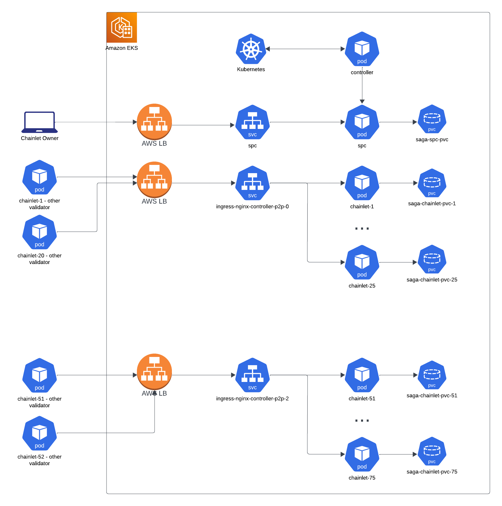

# Pegasus Architecture

## Background
Saga is a Cosmos based blockchain to launch other dedicated blockchains (“chainlets”). At the moment, the operations happen on two separate blockchains:
- Saga Platform Chain (“SPC”)
- Saga Security Chain (“SSC”)

The former is responsible for the chainlet life cycle:
- Launching a chainlet
- Paying for a chainlet

The latter is where the security and validation happens and where the SAGA token lives:
- Staking operations
- Token transfers

When a chainlet is launched, the transaction is committed on SPC and all the validators are responsible to spin up the chainlet with the provided parameters and produce blocks. Chainlets are paid by a designated escrow account, when the account runs out of tokens, the chainlet is decommissioned by all validators. Validators are responsible for running SPC and all the chainlets.

We are DEPRECATING SPC. In the near future SSC will be responsible for all the state, security and operations and we will achieve shared security. Although, in the phase 1 of Pegasus, validators are required to run SPC together with the already running SSC. The latter, for now, is not part of this document, as it is not part of the Pegasus stack. No changes are required to how SSC is currently run.

## Orchestration
We are relying on Kubernetes as an infrastructure orchestrator. On top of Kubernetes we have an application/chainlet level orchestration: Saga Controller (“controller”). The controller implements a standard control loop reading the state from SPC and changing the resources of the kubernetes cluster. The way a chainlet is deployed is defined by the chainlet template passed to the controller. As of right now, this template has a deployment, a pvc and a service. There are three typical use cases for the controller:
- A new chainlet is created in SPC => The controller deploys the chainlet in the k8s cluster
- A chainlet runs out of upsaga tokens => The controller deallocates the resources in the chainlet namespace
- A chainlet deployment is deleted/downscaled => The controller restores it based on the template if the chainlet is still online

## Implementation
We are running an EKS cluster on AWS (managed Kubernetes). When started those are the main applications running.

INFRA
- Ingress Nginx: ingress controller responsible for routing the incoming p2p traffic to SPC and chainlets.
- Karpenter: manages node autoscaling on AWS.
- Kube prometheus stack: it provides a Prometheus operator initialized with prometheus, grafana and alertmanager.
- Fluentd (optional): DaemonSet to push logs to the cloud

SAGA SPECIFIC
- SPC: see above
- Controller: see above

Once SPC is in sync, the controller will start spinning up the chainlet resources and namespaces and make sure they are consistent at any time with the latest state of SPC.

## Networking
The nginx ingress controller is publicly exposed via AWS LoadBalancer(s). Ingress Nginx is configured to handle TCP and UDP traffic for the chainlets (see [Exposing TCP and UDP services](https://kubernetes.github.io/ingress-nginx/user-guide/exposing-tcp-udp-services/)). Given an AWS limit of targets per LB, the controller will have to allocate multiple LBs. Currently, each LB will handle 25 chainlets. So the first 25 chainlets will be associated with the LoadBalancer service “ingress-nginx-controller-p2p-0”, from port 1025 to 1049. The following 25 chainlets will be handled by “ingress-nginx-controller-p2p-1” from port 1025 to 1049 and so forth. Chainlets are aware of the public LB address and port associated with them and gossip that to other nodes in order to be reachable. SPC is exposed directly via LoadBalancer service (“spc” in the “sagasrv-spc” namespace). We are only exposing the p2p port publicly (26656). SPC services like RPC are only exposed locally via ClusterIP service (“spc-internal”).

## AWS Dependencies
Our end goal is to have the stack totally cloud agnostic and easy to run on premise to increase decentralization. Although, for now, there are a few dependencies on the AWS stack:
- EKS
- Karpenter Autoscaler
- Networking through AWS LoadBalancer
- EBS as storage

## Metrics
We are deploying the kube prometheus stack ([github](https://github.com/prometheus-community/helm-charts/tree/main/charts/kube-prometheus-stack)) for monitoring in the `sagasrv-metrics` namesace. With dynamic prometheus targets via annotations, we are scraping chainlet metrics once added. Grafana comes with dashboards provisioned as code to measure the system status both on an infrastructure and chainlet level. For the chainlets we are using the prometheus metrics exposed by the cosmos SDK. In addition it is possible to deploy cosmos exporter for each chainlets ([github](https://github.com/solarlabsteam/cosmos-exporter)).

## Alerting
Alerting is handled by the Alertmanager with CRDs (PrometheusRule). The kube prometheus stack comes with an extensive set of alerts tailored to Kubernetes clusters. On top of that, we are also deploying some application level alerts (e.g.: missed blocks, chainlet not producing blocks, etc). We are running separately a blackbox monitor to evaluate the chainlets status independently from the single validator clusters.

## Life of a chainlet
This is what happens in several scenarios.

A chainlet is created:
1. A user submits a chainlet creation transaction
1. The controller reads from the local SPC node the data of the new chainlets
1. Since the deployment is not present in the cluster, the controller deploys a chainlet deployment with the data read from SPC (e.g.: genesis params, chain id, etc)
1. If there is not an available load balancer slot it spins up a new LoadBalancer service
1. It adds a new sequential TCP port to the most recent LB and maps it to the chainlet p2p ClusterIP service.
1. The chainlet application starts and coordinates a genesis with the other validators, advertising the LB address on chain
1. Once the consensus is reached the chainlet starts producing blocks

A chainlet runs out of funds:
1. The controller infer the event reading from SPC
1. If the deployment is still up and running, it downscales it to 0 along with the services and service mapping associated with it

A chainlet is restarted:
1. The resources destroyed in the previous paragraph get reinstated
1. The Persistent Volume gets reattached
1. The application restarts from where it left

For the last two scenarios, the PVs are preserved. For efficiency, we will change that in the future and rather archive a volume snapshot, freeing the PV.

## Genesis coordination
All the genesis params are inferred from SPC and the genesis file is generated deterministically.

## Out of scope: Service Providers
Services like RPC nodes and explorers are run by Service Providers. They use the same stack as the validators but will run non validating nodes for each chainlet along with the applications required (RPC, API, Explorers). Validators are not required to run Service Providers.
